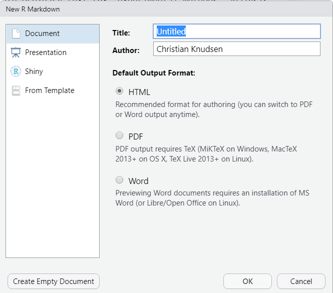
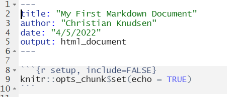

```{r, include=FALSE}
source("../bin/chunk-options.R")
knitr_fig_path("01-")
```

https://umcarpentries.org/intro-curriculum-r/05-r-markdown/index.html

In R Markdown, you can incorporate ordinary text (ex. experimental methods, analysis and discussion of results) alongside code and figures! (Some people write entire manuscripts in R Markdown.) This is useful for writing reproducible reports and publications, sharing work with collaborators, writing up homework, and keeping a bioinformatics notebook. Because the code is emedded in the document, the tables and figures are reproducible. Anyone can run the code and get the same results. If you find an error or want to add more to the report, you can just re-run the document and you’ll have updated tables and figures! This concept of combining text and code is called “literate programming”. To do this we use R Markdown, which combines Markdown (renders plain text) with R. You can output an html, PDF, or Word document that you can share with others. In fact, this webpage is an example of a rendered R markdown file!

(If you are familiar with Jupyter notebooks in the Python programming environment, R Markdown is R’s equivalent of a Jupyter notebook.)

Lets get started! 

As always we open RStudio, and begin a new project 

SCREENSHOTS/GRABS/GIFs

In order for RStudio to handle the markdown correctly, we choose 
"file -> New file -> R Markdown"


We give our document a title, change the Author name if necessary. And choose 
HTML output.

Word documents can be produced directly, PDFs requires a bit more work, we will get 
back to that.

We now have a nice document, formatted in a special way.

First we note that title, author, date and output are enclosed between two sets
of dashes:


That is the yaml-header. After that we have a code block.
01 Intro
  yaml-headeren

02 chunks og kode, inline

03 Text formattering

04 formler

05 Mere avancerede teknikker
  Parametrisk
  Et udvalg af nedenstående
  


Et hurtigt html output - med et plot og noget.

Der er ting vi ikke gider se på. include = F tilføjes.
Men måske vi er ude efter echo = F

Så - hvad sker der?

rmarkdown er pakken der konverterer markdown dokumenter til diverse output formater.

Dens render funktion tager RMarkdown input, og skaber Markdown filer.

Dynamisk genering håndteres af knitr 
[er det her overhovedet korrekt?]

Pandoc er systemet der konverterer md til diverse andre formater.
Eksempelvis latex, der så bruges til at producere pdf.

Hvad kan man gøre i HTML?

Yaml-headeren kan gøre ting.

---
title: "R-markdown"
author: "KUB Datalab"
date: "`r format(Sys.time(), '%d %B %Y')`"
output:
  html_document:
    toc: true
    toc_float: true
    code_folding: hide
---

The date field has inline R code to dynamically insert the current date
The html_document setting for output: has three sub-settings:
toc: true generates a table of contents (based on # and ## lines)
toc_float: true makes it ‘floating’
code_folding: hide turns on code folding with a default of hidden code


inline kode

tabeller

Formler

LaTeX:
https://www.calvin.edu/~rpruim/courses/s341/S17/from-class/MathinRmd.html


Indsætningaf billeder

Pænere formattering af tabeller

Headers 

Lister - nummererede og bulletpoints

kursiv, fed

https://rpubs.com/bpbond/630335


You can use tabs to organize your content:

## Tabs {.tabset}

### Tab 1 name
(content)

### Tab 2 name
(content)


Printing data frames
For HTML output only, you can add the df_print: paged parameter to your YAML header to have printed data frames rendered as HTML tables.

output:
  html_document:
    df_print: paged
    
    
Themes:
output:
  html_document:
    theme: sandstone
    highlight: tango

    
`r knitr::combine_words(LETTERS[1:10])`.


Gad vide hvad knitr har af andre funktioner af den slags?


Chunk defaults
knitr::opts_chunk$set(echo = TRUE)

Computable chunk options
Chunk options can take non-constant values; in fact, they can take values from arbitrary R expressions:

```{r}
# Define a global figure width value
my_fig_width <- 7
```

```{r, fig.width = my_fig_width}
plot(cars)
```
An example of R code in a chunk option setting:

```{r}
width_small <- 4
width_large <- 7
small_figs <- TRUE
```

```{r, fig.width = if(small_figs) width_small else width_large}
plot(cars)
```
Here’s a chunk that only executes when a particular package is available:

```{r, eval = require("ggplot2")}
ggplot2::ggplot(cars, aes(speed, dist)) + geom_point()
```


Opdeling af dokumenter som childs:
https://bookdown.org/yihui/rmarkdown-cookbook/child-document.html


Don’t forget about the cache=TRUE chunk option. Critical for keeping the build time of longer, complex documents under control.

Two trailing spaces are used to force a line break:

This line does not has two spaces at the end. The following line.

This line has two spaces at the end.
The following line.


Parameters
R Markdown documents can take parameters. These are specified in the YAML header as a name followed by a default value:

params:
  cut: NULL
  min_price: 0
and can then be accessed by code in the document, via a read-only list called params:

print(params$min_price)
Let’s go make an R Markdown document that takes one or more parameters, for example to produce a report on some part of the diamonds dataset.

render
So far so good, but how do we use this capability programmatically?

The rmarkdown::render() function converts an input file to an output format, usually calling knitr::knit() and pandoc along the way.

rmarkdown::render("diamonds-report.Rmd", 
  params = list(cut = "Ideal"),
  output_file = "Ideal.html")


Neat R packages
plotly
Interactive graphics.

DT
Handy if you want to sort or filter your table data.

reactable
library(dplyr)
library(sparkline)
library(reactable)

data <- chickwts %>%
  group_by(feed) %>%
  summarise(weight = list(weight)) %>%
  mutate(boxplot = NA, sparkline = NA)

reactable(data, columns = list(
  weight = colDef(cell = function(values) {
    sparkline(values, type = "bar", chartRangeMin = 0, chartRangeMax = max(chickwts$weight))
  }),
  boxplot = colDef(cell = function(value, index) {
    sparkline(data$weight[[index]], type = "box")
  }),
  sparkline = colDef(cell = function(value, index) {
    sparkline(data$weight[[index]])
  })
))


leaflet
I really like the simplicty of the leaflet package.


Citations and references
We might want to include citations. This is surprisingly easy; the source

In a subsequent paper [@Bond-Lamberty2009-py], we used the
same model outputs to examine the _hydrological_ implications
of these wildfire regime shifts [@Nolan2014-us]. 
Nolan et al. [-@Nolan2014-us] found that...

---
bibliography: bibliography.json
---

https://www.rstudio.com/wp-content/uploads/2015/03/rmarkdown-reference.pdf

